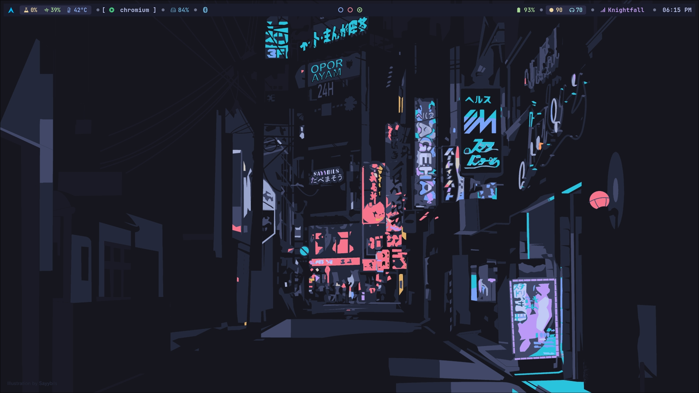
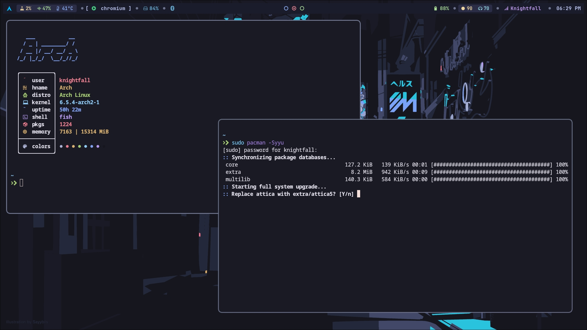
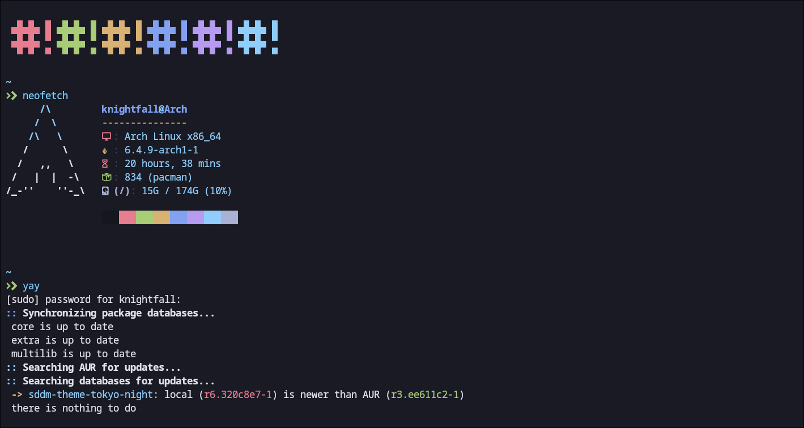
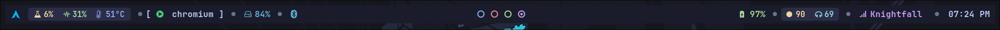
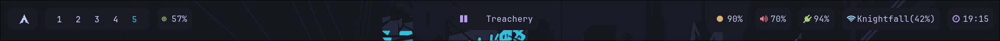

<!-- # By micro-hawk on Github as a part of https://github.com/micro-hawk/Hyprland-config -->


<div align="center">

# 💠 Dot Files - Hypr Config 💠

[](https://github.com/micro-hawk/hyprland-dotfiles/stargazers) [](https://github.com/micro-hawk/hyprland-dotfiles/commits/main) 
<!-- [](https://github.com/micro-hawk/hyprland-dotfiles) -->


<br/>


<br>


<br>


<br>

### Tokyo Night Kitty Terminal Color Scheme



### Waybar Configs:

#### Config


<br>

<!-- #### Old Config -->

<!--  -->
<!-- <br> -->


<!-- <p> Replace the `config-3.0` in the hypr config with `tokyonightconfig and tokyonightstyle.css` to use the old configuration. <p> -->

</div>

<div align="center">

## Theming
</div>

### GTK theme 
1. Download your fav theme and place the theme folder at : `/usr/share/themes` or `.local/share/themes`    
* i just use        
```
yay -S layan-gtk-theme-git
```
2. to set it up , just run        
```
gsettings set org.gnome.desktop.interface gtk-theme Layan-Dark
```
* for dark theme , you have to make changes at your : `~/.config/gtk-3.0/settings.ini`         
* * settings.ini -->  `gtk-application-prefer-dark-theme=true`  &  `gtk-theme-name=Layan-Dark`         

### GTK icons 

1. Download and place in `/usr/share/icon`   ( i use Kora btw )    
```
yay -S kora-icon-theme
```
2. and then just run          
```
gsettings set org.gnome.desktop.interface icon-theme {theme-folder}
```

### cursor theme 
1. Download and put them in : `/usr/share/icons/`          
* i use          
```
yay -S catppuccin-mocha-dark-cursors 
```
2. and then edit `/usr/share/icons/default/index.theme`           
3. also  
```
gsettings set org.gnome.desktop.interface cursor-theme {theme-folder}
```
 
### Fonts 
1.  Download ttf files and put them in : `/usr/local/share/fonts`     
2.  then give'em necesarry permissions like : `chmod 444 and 555`    

>  refer to powerlevel10k github readme font section for mesloLGS-nf  fonts

### SDDM theme 
1. Download sddm theme you want , and place them at : `/usr/share/sddm/themes/`         
2. set the theme , at `/usr/lib/sddm/sddm.conf.d/default.conf`        
* if that doesn't work , check out this place : `/etc/sddm.conf.d/`

### GRUB theme
1. Download and place at : `/usr/share/grub/themes/`            
2. then just edit `/etc/default/grub` : GRUB_THEME=`/usr/share/grub/themes/{theme_name}/theme.txt`      
3. a lil `grub-update` and you are good to go           

<br>


# Details
- **OS**: Arch Linux
- **Compositor**: [Hyprland](https://github.com/hyprwm/Hyprland)
- **Top Bar**: [Waybar](https://github.com/Alexays/Waybar/)
- **Notifications**: [dunst](https://github.com/dunst-project/dunst)
- **Wallpaper**: `../wallpaper/dawn.png`
- **Terminal**: [kitty](https://github.com/kovidgoyal/kitty)
- **Search menu**: [wofi](https://github.com/uncomfyhalomacro/wofi)
- **Fetch script**: `Neofetch`
- **Themes**: `Use the waybar config as configcat and stylecss as stylecat`

